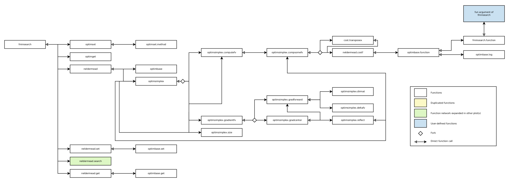
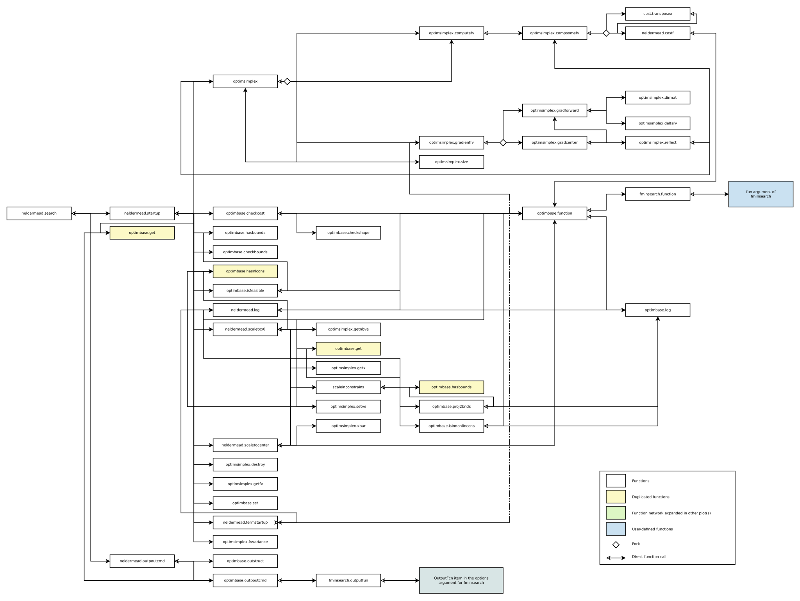
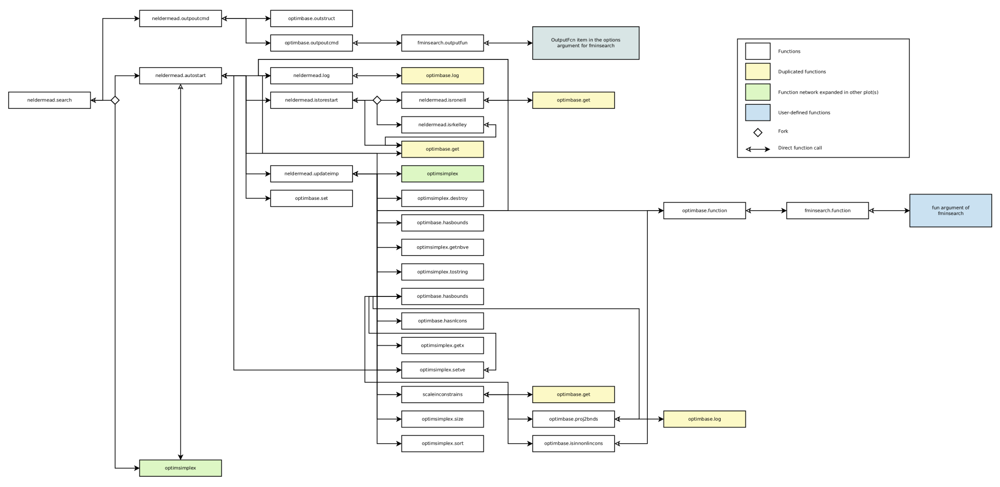
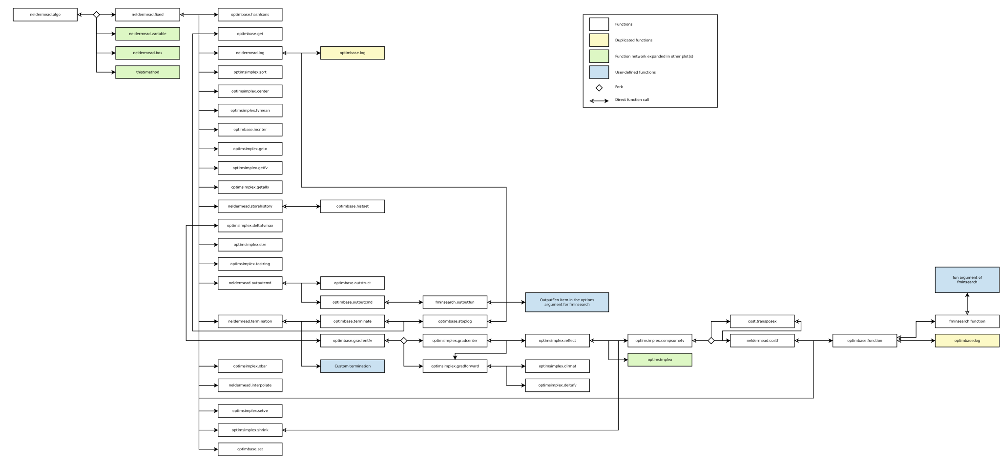
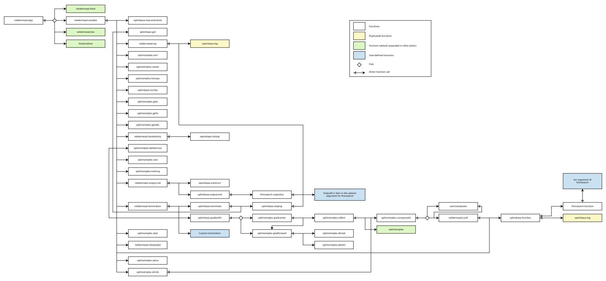
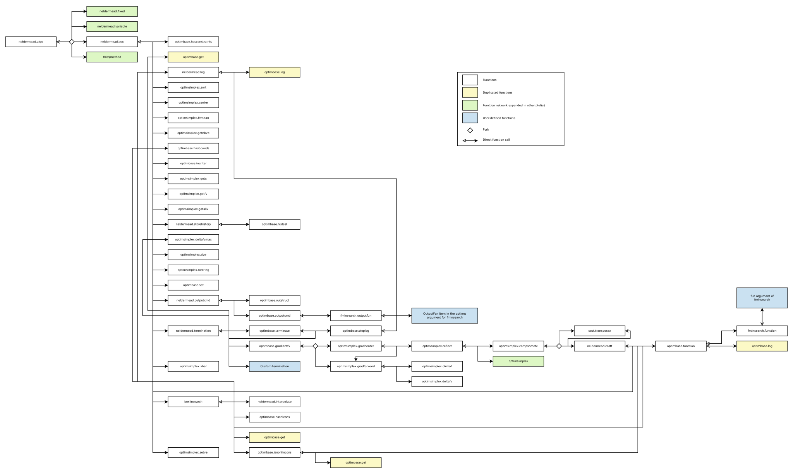

```{r setup, include = FALSE}
knitr::opts_chunk$set(echo = TRUE)
```

`neldermead` is a R port of a module originally developed for Scilab version
5.2.1 by Michael Baudin (INRIA - DIGITEO). Information about this software can
be found at [www.scilab.org](https://www.scilab.org). The following documentation as well
as the content of the functions .Rd files are adaptations of the documentation provided
with the original Scilab neldermead module.

`neldermead` currently does not include any adaptation of the Scilab
'nmplot' function series that is available in the original `neldermead` module.

# Overview

```{r, echo = FALSE, message = FALSE}
options(width = 75)
require(neldermead)
```

## Description

The goal of this toolbox is to provide several direct search optimization
algorithms based on the simplex method. The optimization problem to solve is the
minimization of a cost function, with bounds and nonlinear constraints.

$$
  \begin{array}{l l}
    min f(x)\\
    l_i \le{} x_i \le{} h_i, & i = 1,n \\
    g_j(x) \ge{} 0, & j = 0,nb_{ineq} \\\\
  \end{array}
$$
 
where $f$ is the cost function, $x$ is the vector of parameter estimates,
$l$ and $h$ are vectors of lower and upper bounds for the parameter
estimates, $n$ is the number of parameters and $nb_{ineq}$ the number of
inequality constraints $g(x)$.

The provided algorithms are direct search algorithms, i.e. algorithms which do
not use the derivative of the cost function. They are based on the update of a
simplex, which is a set of $k \ge n+1$ vertices, where each vertex is
associated with one point and one function value.

The following algorithms are available: 

* The fixed shape simplex method of Spendley, Hext and Himsworth: this algorithm
solves an unconstrained optimization problem with a fixed shape simplex made of
$k = n+1$ vertices.
* The variable shape simplex method of Nelder and Mead: this algorithm solves
an unconstrained optimization problem with a variable shape simplex made of 
$k = n+1$ vertices @neldermead_1965.
* Box's complex method: this algorithm solves an constrained optimization 
problem with a variable shape simplex made of an arbitrary k number of vertices 
($k = 2n$ is recommended by Box).

## Basic object

The basic object used by the `neldermead` package to store the configuration
settings and the history of an optimization is a 'neldermead' object, i.e. a
list typically created by `neldermead` and having a strictly defined
structure (see `?neldermead` for more details).

## The cost function

The `function` element of the `neldermead` object allows to configure the
cost function. The cost function is used to compute the objective function
value $f$. If the `nbineqconst` element of the `neldermead` object is
configured to a non-zero value, the cost function must also compute the value
of the nonlinear, positive, inequality constraints $c$. The cost function
can also take as input/output an additional argument, if the
`costfargument` element is configured. The function should be defined as
described in `vignette('manual', package = 'optimbase')`:

```{r eval = FALSE}
  costf <- function(x, index, fmsfundata){
    # Define f and c here #
    return(list(f, g = NULL, c, gc = NULL, index = index,
                this = list(costfargument = fmsfundata)))
  }
```

where:

* `x`: is the current point, as a column vector,
* `index`: (optional), an integer representing the value to compute,
* `fmsfundata`: an user-provided input/output argument,
* `f`: the value of the objective function (a scalar),}
* `g`: typically the gradient of the objective function in the context of the 
`optimbase` functions; must be set to NULL as the Nelder-Mead is not gradient-based,
* `c`: the vector of values of non-linear, positive, inequality constraints,
* `gc`: typically the gradient of the constraints in the context of the 
`optimbase` functions; must be set to NULL as the Nelder-Mead is not gradient-based, and
* `this`: must be set to `list(costfargument = fmsfundata)`.

The `index` input parameter tells the cost function what to return as output
arguments (as described in `vignette('manual', package = 'optimbase')`. It
has the following meaning:

* index = 2: compute `f`,
* index = 5: compute `c`,
* index = 6: compute `f` and `c`

The `fmsdata` argument is both input and output. This feature may be used
in the situation where the cost function has to update its environment from call
to call. Its simplest use is to count the number of calls to the cost function,
but this feature is already available directly. Consider the more practical
situation where the optimization requires the execution of an underlying Newton
method (a chemical solver for example). This Newton method requires an initial
guess $x_0$. If the initial guess for this underlying Newton method is kept
constant, the Newton method may have problems to converge when the current
optimization point get far away from the its initial point. If a
`costfargument` element is defined in the `neldermead` object, it can be
passed to the cost function as the `fmsdata` argument. In this case, the
initial guess for the Newton method can be updated so that it gets the value of
the previous call. This way, the Newton method will have less problems to
converge and the cost function evaluation may be faster.

We now present how the feature works. Every time the cost function is called
back, the `costfargument` element is passed to the cost function
as an input argument. If the cost function modifies its content in the output
argument, the content of the `costfargument` element is updated
accordingly. Once the optimization is performed, the user may call the
`neldermead.get` function and get back an updated `costfargument`
content.
 
## The output function

The `outputcommand` element of the `neldermead` object allows to configure
a command which is called back at the start of the optimization, at each
iteration and at the end of the optimization. The output function must be
defined as follows:

`outputcmd <- function(state, data, myobj)`

where: 

* `state`: is a string representing the current state of the algorithm. 
Available values are 'init', 'iter', and 'done',
* `data`: a list containing at least the following entries:
    + `x`: the current optimum,
    + `fval`: the current function value,
    + `iteration`: the current iteration index,
    + `funccount`: the number of function evaluations,
    + `simplex`: the current simplex,
    + `step`: the previous step in the algorithm. The following values are 
    available: 'init', 'done', 'reflection', 'expansion', 'insidecontraction', 
    'outsidecontraction', 'reflectionnext', and 'shrink',
* `myobj`: a user-defined parameter. This input parameter is defined with the
`outputcommandarg` element of the `neldermead` object.

The `output` function may be used when debugging the specialized optimization
algorithm, so that a verbose logging is produced. It may also be used to write
one or several report files in a specialized format (ASCII, LaTeX, Excel,
etc...). The user-defined parameter may be used in that case to store
file names or logging options.

The `data` list argument may contain more fields than the current
presented ones. These additional fields may contain values which are specific
to the specialized algorithm, such as the simplex in a Nelder-Mead method, the
gradient of the cost function in a BFGS method, etc...

## Termination

The current package takes into account several generic termination criteria. The
following termination criteria are enabled by default:

* maxiter,
* maxfunevals,
* tolxmethod,
* tolsimplexizemethod.

The `neldermead.termination` function uses a set of rules to compute if
the termination occurs and sets optimization status to one of the following:
'continue', 'maxiter', 'maxfunevals', 'tolf', 'tolx', 'tolsize',
'tolsizedeltafv', 'kelleystagnation', 'tolboxf' or 'tolvariance'. The
value of the status may also be a user-defined string, in the case where a
user-defined termination function has been set.

The following set of rules is examined in this order.

* By default, the status is 'continue' and the terminate flag is FALSE.
* The number of iterations is examined and compared to the `maxiter` element of
the `neldermead` object: if `iterations` $\ge$ `maxiter`, then the status is set 
to 'maxiter' and terminate is set to TRUE.
* The number of function evaluations is examined and compared to the `maxfunevals` 
elements: if `funevals` $\ge$ `maxfunevals`, then the status is set to 'maxfuneval'
and terminate is set to TRUE.
* The tolerance on function value is examined depending on the value of the 
`tolfunmethod`.
    + FALSE: then the criteria is just ignored,
    + TRUE: if $|currentfopt| < tolfunrelative \cdot |previousfopt|  + tolfunabsolute$, 
    then the status is set to 'tolf' and terminate is set to TRUE.
    
    The relative termination criteria on the function value works well if the
    function value at optimum is near zero. In that case, the function value
    at initial guess $fx0$ may be used as $previousfopt$. This criteria is
    sensitive to the $tolfunrelative$ and $tolfunabsolute$ elements.
    The absolute termination criteria on the function value works if the user
    has an accurate idea of the optimum function value.
* The tolerance on x is examined depending on the value of the `tolxmethod` element.
    + FALSE: then the criteria is just ignored,
    + TRUE: if $norm(currentxopt - previousxopt) < tolxrelative \cdot norm(currentxopt) + tolxabsolute$, 
    then the status is set to 'tolx' and terminate is set to TRUE.
    
    This criteria is sensitive to the `tolxrelative` and `tolxabsolute` elements. 
    The relative termination criteria on x works well if x at optimum is
    different from zero. In that case, the condition measures the distance
    between two iterates.
    The absolute termination criteria on x works if the user has an accurate
    idea of the scale of the optimum x. If the optimum x is near 0, the
    relative tolerance will not work and the absolute tolerance is more
    appropriate.
* The tolerance on simplex size is examined depending on the value of the 
`tolsimplexizemethod` element.
    + FALSE: then the criteria is just ignored,
    + TRUE: if $ssize < tolsimplexizerelative \cdot simplexsize0 + tolsimplexizeabsolute$,
    where $simplexsize0$ is the size of the simplex at iteration 0, then the status
    is set to 'tolsize' and terminate is set to TRUE.
    
    The size of the simplex is computed from the 'sigmaplus' method of the
    `optimsimplex` package. This criteria is sensitive to the `tolsimplexizeabsolute` 
    and the `tolsimplexizerelative` elements.
* The absolute tolerance on simplex size and absolute difference of function 
value is examined depending on the value of the `tolssizedeltafvmethod` element.
    + FALSE: then the criteria is just ignored,
    + TRUE: if both the following conditions $ssize < tolsimplexizeabsolute$ and 
    $shiftfv < toldeltafv$ are true where $ssize$ is the current simplex size and 
    $shiftfv$ is the absolute value of the difference of function value between 
    the highest and lowest vertices, then the status is set to 'tolsizedeltafv' and
    terminate is set to TRUE.
* The stagnation condition based on Kelley sufficient decrease condition is 
examined depending on the value of the `kelleystagnationflag` element.
    + FALSE: then the criteria is just ignored,
    + TRUE: if $newfvmean \le oldfvmean - alpha \cdot t(sg) \cdot sg$ where 
    $newfvmean$ (resp. $oldfvmean$) is the function value average in the current 
    iteration (resp. in the previous iteration), then the status is set to 
    'kelleystagnation' and terminate is set to TRUE. Here, $alpha$ is a 
    non-dimensional coefficient and $sg$ is the simplex gradient.
* The termination condition suggested by Box is examined depending on the value
of the `boxtermination` element.
    + FALSE: then the criteria is just ignored,
    + TRUE: if both the following conditions $shiftfv < boxtolf$ and 
    $boxkount == boxnbmatch$ are true, where $shiftfv$ is the difference of 
    function value between the best and worst vertices, and `boxkount` is the 
    number of consecutive iterations where this criteria is met, then the status
    is set to 'tolboxf' and terminate is set to TRUE. Here, the `boxtolf` 
    parameter is the value associated with the `boxtolf` element of the 
    `neldermead` object and is a user-defined absolute tolerance on the function 
    value. The `boxnbmatch` parameter is the value associated with the 
    `boxnbmatch` element and is the user-defined number of consecutive match.
* The termination condition based on the variance of the function values in the
simplex is examined depending on the value of the `tolvarianceflag` element.
    + FALSE: then the criteria is just ignored,
    + TRUE: if $var < tolrelativevariance \cdot variancesimplex0 + tolabsolutevariance$,
    where $var$ is the variance of the function values in the simplex, then the 
    status is set to 'tolvariance' and terminate is set to TRUE. Here, the 
    `tolrelativevariance` parameter is the value associated with the
    `tolrelativevariance` element of the `neldermead` object and is a
    user-defined relative tolerance on the variance of the function values. The 
    `tolabsolutevariance` parameter is the value associated with the 
    `tolabsolutevariance` element and is the user-defined absolute
    tolerance of the variance of the function values.
* The user-defined termination condition is examined depending on the value of
the `myterminateflag` element.
    + FALSE: then the criteria is just ignored,
    + TRUE: if the `term` boolean output argument returned by the termination 
    function is TRUE, then the status is set to the user-defined status and 
    terminate is set to TRUE.

# Notes about optimization methods

## Kelley's stagnation detection

The stagnation detection criteria suggested by Kelley is based on a sufficient
decrease condition, which requires a parameter alpha > 0 to be defined
@kelley_1999. The `kelleynormalizationflag` element of the `neldermead`
object allows to configure the method to use to compute this alpha parameter.
Two methods are available, where each method corresponds to a different paper by
Kelley:

* constant: in 'Detection and Remediation of Stagnation in the Nelder-Mead 
Algorithm Using a Sufficient Decrease Condition', Kelley uses a constant alpha, 
with the suggested value 1.e-4, which is the typical choice for line search method.
* normalized: in 'Iterative Methods for Optimization', Kelley uses a normalized 
alpha, computed from the following formula: $alpha = alpha0 \cdot sigma0 / nsg$,
where $sigma0$ is the size of the initial simplex and $nsg$ is the norm of the
simplex gradient for the initial guess point.


## O'Neill's factorial optimality test

In 'Algorithm AS47 - Function minimization using a simplex procedure', O'Neill
presents a fortran 77 implementation of the simplex method @oneill_1971. A
factorial test is used to check if the computed optimum point is a local
minimum. If the `restartdetection` element of the `neldermead` object is set
to 'oneill', that factorial test is used to see if a restart should be
performed.

## Method of Spendley *et al.*

The original paper may be implemented with several variations, which might lead
to different results @spendley_1962. This section defines what algorithmic
choices have been used in the present package.

The paper states the following rules.
* 'Rule 1. Ascertain the lowest reading y, of yi ... yk+1 Complete a new simplex
Sp by excluding the point Vp corresponding to y, and replacing it by V* defined 
as above.'
* 'Rule 2. If a result has occurred in (k + 1) successive simplexes, and is not 
then eliminated by application of Rule 1, do not move in the direction indicated 
by Rule 1, or at all, but discard the result and replace it by a new observation 
at the same point.'
* 'Rule 3. If y is the lowest reading in So , and if the next observation made, 
y* , is the lowest reading in the new simplex S , do not apply Rule 1 and return
to So from Sp . Move out of S, by rejecting the second lowest reading (which is
also the second lowest reading in So).'

We implement the following 'rules' of the Spendley *et al.* method:

* Rule 1 is strictly applied, but the reflection is done by reflection of the 
high point, since we minimize a function instead of maximizing it, like Spendley.
* Rule 2 is NOT implemented, as we expect that the function evaluation is not
subject to errors.
* Rule 3 is applied, i.e. reflection with respect to next to the high point. The
original paper does not mention any shrink step. When the original algorithm 
cannot improve the function value with reflection steps, the basic algorithm 
stops. In order to make the current implementation of practical value, a shrink 
step is included, with shrinkage factor sigma. This perfectly fits into to the 
spirit of the original paper. Notice that the shrink step makes the rule \#3 
(reflection with respect to next-to-worst vertex) unnecessary. Indeed, the
minimum required steps are the reflection and shrinkage. Nevertheless, the rule 
\#3 has been kept in order to make the algorithm as close as it can be to the original.

## Method of Nelder and Mead

The purpose of this section is to analyse the current implementation of
Nelder-Mead's algorithm. The algorithm that we use is described in 'Iterative
Methods for Optimization' by Kelley.

The original paper uses a 'greedy' expansion, in which the expansion point is
accepted whatever its function value. The current implementation, as most
implementations, uses the expansion point only if it improves over the
reflection point, that is,

* if fe<fr, then the expansion point is accepted,
* if not, the reflection point is accepted.

The termination criteria suggested by Nelder and Mead is based on an absolute
tolerance on the standard deviation of the function values in the simplex. We
provide this original termination criteria with the `tolvarianceflag`
element of the `neldermead` object, which is disabled by default.

## Box's complex algorithm

In this section, we analyse the current implementation of Box's complex method
@box_1965. The initial simplex can be computed as in Box's paper, but this may 
not be safe. In his paper, Box suggests that if a vertex of the initial simplex 
does not satisfy the non linear constraints, then it should be 'moved halfway 
toward the centroid of those points already selected'. This behaviour is 
available when the `scalingsimplex0` element of the `neldermead` object is set 
to 'tocenter'. It may happen, as suggested by Guin @guin_1968, that the centroid 
is not feasible if the constraints are not convex. In this case, the initial simplex
cannot be computed. This is why we provide the 'tox0' option, which allows to
compute the initial simplex by scaling toward the initial guess, which is always
feasible.

In Box's paper, the scaling into the non linear constraints is performed
'toward' the centroid, that is, by using a scaling factor equal to 0.5. This
default scaling factor might be sub-optimal in certain situations. This is why
we provide the `boxineqscaling` element, which allows to configure
the scaling factor.

In Box's paper, whether we are concerned with the initial simplex or with the
simplex at a given iteration, the scaling for the non linear constraints is
performed without end. This is because Box's hypothesis is that 'ultimately, a
satisfactory point will be found'. As suggested by Guin, if the process fails,
the algorithm goes into an infinite loop. In order to avoid this, we perform the
scaling until a minimum scaling value is reached, as defined by the
`guinalphamin` element.

We have taken into account the comments by Guin, but it should be emphasized
that the current implementation is still as close as possible to Box's algorithm
and is not Guin's algorithm. More precisely, during the iterations, the scaling
for the non linear constraints is still performed toward the centroid, be it
feasible or not.

## User-defined algorithm

The `mymethod` element of the `neldermead` object allows to configure a
user-defined simplex-based algorithm. The reason for this option is that many
simplex-based variants of Nelder-Mead's algorithm have been developed over the
years, with specific goals. While it is not possible to provide them all, it is
very convenient to use the current structure without being forced to make many
developments.

The value of the `mymethod` element is expected to be a R function with the
following structure:

```{r eval = FALSE}
  myalgorithm <- function( this ){
    ...
    return(this)
  }
```

where `this` is the current `neldermead` object.

In order to use the user-defined algorithm, the `method` element must be
set to 'mine'. In this case, the component performs the optimization exactly as
if the user-defined algorithm was provided by the component.

The user interested in that feature may use the internal scripts provided in the
distribution as templates and tune his own algorithm from that point. There is
of course no warranty that the user-defined algorithm improves on the standard
algorithm, so that users use this feature at their own risks.

## User-defined termination

Many termination criteria are found in the literature. Users who aim at
reproducing the results exhibited in a particular paper may find that that none
of the provided termination criteria match the one which is used in the paper.
It may also happen that the provided termination criteria are not suitable for
the specific test case. In those situation the `myterminate` element of
the `neldermead` object allows to configure a user-defined termination
function. The value of the `myterminate` element is expected to be a R
function with the following structure:

```{r eval = FALSE}
  mystoppingrule <- function( this , simplex ){
    ...
    return(list(this = this, terminate = terminate, status = status))
  }
```

where `this` is the current `neldermead` object and `simplex` is the
current simplex. The `terminate` output argument is a logical flag which is
FALSE if the algorithm must continue and TRUE if the algorithm must stop.
The `status` output argument is a string which is associated with the
current termination criteria.

In order to enable the use of the user-defined termination function, the value
of the `myterminateflag` element must be set to TRUE in the `neldermead`
object. At each iteration, if the `myterminateflag` element has been set to
TRUE, the user-defined termination is called. If the terminate output argument
is TRUE, then the algorithm is stopped. In that case, the value of the
`status` element of the `neldermead.get` function output is the value
of the `status} output argument of the user-defined termination function.

# Specialized functions 

## `fminsearch`

The `fminsearch` function is based on a specialized use of the more general
`neldermead` function bundle and searches for the unconstrained minimum of 
a given cost function. This function corresponds to the Matlab (or Scilab) 
fminsearch function. In the context of `fminsearch`, the function to be 
minimized is not a cost function as described above but an objective 
function (returning a numeric scalar). Additional information and examples are 
available in `?fminsearch` from a R environment.

## Direct grid search

Direct grid search, performed by `fmin.gridsearch`, is a functionality 
added to the original Scilab `neldermead` module and constitutes another 
specialized use of the `neldermead` package. This function allows to 
explore the search space of an optimization problem around the initial point 
$x_0$. This optimization problem is defined by an objective function, like
for `fminsearch`, and not a cost function. `fmin.gridsearch`
automatically creates a grid of search points selected around the initial point 
and evaluates the objective function at each point. The boundaries of the grid 
are set either by a vector of parameter-specific lower and upper limits, or by 
a vector of factors $\alpha$ as follows:$[x_{0}/\alpha,x_{0}\times\alpha]$. 
The number $npts$ of points evaluated for each parameter (or dimension of the 
optimization problem) can also be defined. The total number of points in the 
grid is therefore $npts^n$. At the end of the search, `fmin.gridsearch` 
returns a table sorted by value of the objective function. The feasibility of 
the objective function is also determined at each point, as 
`fmin.gridsearch` is a wrapper around `optimbase.gridsearch` which 
assesses the feasibility of a cost function in addition to calculating its value 
at each particular search point. Because `fmin.gridsearch` does not accept 
constraints, the objective function should always be feasible. Additional 
information is available in `?fmin.gridsearch` from a R environment.

# Examples

We present in this section basic examples illustrating the use of `neldermead`
functions to optimize unconstrained or constrained systems. More complex
examples are described in a Scilab-based document written by Michael Baudin and
available at [http://forge.scilab.org/index.php/p/docneldermead/](http://forge.scilab.org/index.php/p/docneldermead/). 
Because the R port of the Scilab `neldermead` module is almost literal, the user
should be able to reproduce the described examples in R with minimal
adaptations.

## Example 1: Basic use

In the following example, we solve a simple quadratic test case. We begin by
defining the cost function, which takes 3 input arguments and returns the value
of the objective function as the $f$ element of a list. The standard 
starting point [-1.2 1.0] is used. `neldermead` creates a new
`neldermead` object. Then we use `neldermead.set` to configure the 
parameters of the problem. We use all default settings and perform the search
for the optimum. `neldermead.get` is finally used to retrieve the optimum 
parameters.

```{r}
  quadratic <- function(x = NULL,index = NULL,fmsfundata = NULL){
    return(list(f = x[1]^2 + x[2]^2,
                g = c(),
                c = c(), 
                gc = c(),
                index = index,
                this = list(costfargument = fmsfundata)))
  }

  x0 <- transpose( c(1.0,1.0) )
  nm <- neldermead()
  nm <- neldermead.set(nm,'numberofvariables',2)
  nm <- neldermead.set(nm,'function',quadratic)
  nm <- neldermead.set(nm,'x0',x0)
  nm <- neldermead.search(nm)
  summary(nm)
```

## Example 2: Customized use

In the following example, we solve the Rosenbrock test case. We begin by
defining the Rosenbrock function, which takes 3 input arguments and returns the
value of the objective function. The standard starting point [-1.2 1.0] is
used. `neldermead` creates a new `neldermead` object. Then we use
`neldermead.set` to configure the parameters of the problem.
The initial simplex is computed from the axes and the single length 1.0 (this is
the default, but is explicitely written here as an example). The variable
simplex algorithm by Nelder and Mead is used, which corresponds to the -method
'variable' option. `neldermead.search` performs the search for
the minimum. Once the minimum is found, we represent part of the search space
using the `contour} function (this is possible since our problem involves
only 2 parameters) and we superimpose the starting point (in red), the
optimisation path (in blue), and the optimum (in green) to the plot. The history
of the optimisation can be retrieved (using `neldermead.get`) because the
'storehistory' option was set to TRUE.

```{r}
  rosenbrock <- function(x = NULL,index = NULL,fmsfundata = NULL){
    return(list(f = 100*(x[2]-x[1]^2)^2+(1-x[1])^2,
                g = c(),
                c = c(),
                gc = c(),
                index = index,
                this = list(costfargument = fmsfundata)))
  }
  x0 <- transpose(c(-1.2,1.0))
  nm <- neldermead()
  nm <- neldermead.set(nm,'numberofvariables',2)
  nm <- neldermead.set(nm,'function',rosenbrock)
  nm <- neldermead.set(nm,'x0',x0)
  nm <- neldermead.set(nm,'maxiter',200)
  nm <- neldermead.set(nm,'maxfunevals',300)
  nm <- neldermead.set(nm,'tolfunrelative',10*.Machine$double.eps)
  nm <- neldermead.set(nm,'tolxrelative',10*.Machine$double.eps)
  nm <- neldermead.set(nm,'simplex0method','axes')
  nm <- neldermead.set(nm,'simplex0length',1.0)
  nm <- neldermead.set(nm,'method','variable')
  nm <- neldermead.set(nm,'verbose',FALSE)
  nm <- neldermead.set(nm,'storehistory',TRUE)
  nm <- neldermead.set(nm,'verbosetermination',FALSE)
  nm <- neldermead.search(nm)
  
  xmin <- ymin <- -2.0 
  xmax <- ymax <- 2.0 
  nx <- ny <- 100
  stepy <- stepx <- (xmax - xmin)/nx
  ydata <- xdata <- seq(xmin,xmax,stepx)
  zdata <- apply(expand.grid(xdata,ydata),1,
                 function(x) neldermead.function(nm,transpose(x)))
  zdata <- matrix(zdata,ncol = length(ydata))
  optimpath <- matrix(unlist((neldermead.get(nm,'historyxopt'))),
                      nrow = 2)
  optimpath <- data.frame(x = optimpath[1,],y = optimpath[2,])

  contour(xdata,ydata,zdata,levels = c(1,10,100,500,1000,2000))
  par(new = TRUE,ann = TRUE)
  plot(c(x0[1],optimpath$x[158]), c(x0[2],optimpath$y[158]),
       col = c('red','green'),pch = 16,xlab = 'x[1]',ylab = 'x[2]',
       xlim = c(xmin,xmax),ylim = c(ymin,ymax))
  par(new = TRUE,ann = FALSE)  
  plot(optimpath$x,optimpath$y,col = 'blue',type = 'l',
       xlim = c(xmin,xmax),ylim = c(ymin,ymax))
```

Setting the 'verbose' element of the `neldermead` object to 1 allows to get
detailed information about the current optimization process. The following is a
sample output for an optimization based on the Nelder and Mead variable-shape
simplex algorithm. Only the output corresponding to the iteration \#156 is
displayed. In order to display specific outputs (or to create specific output
files and graphics), the 'outputcommand' option should be used.

```
 == == == == == == == == == == == == == == == == == == == == == == == == == == == == == == == == = 
Iteration \#156 (total = 156)
Function Eval \#298                                                             
Xopt: 0.99999999999991 0.999999999999816                                        
Fopt: 8.997809e-27                                                              
DeltaFv: 4.492261e-26                                                           
Center: 1.00000000000003 1.00000000000007                                       
Size: 4.814034e-13                                                              
Vertex \#2/3 : fv = 2.649074e-26, x = 1.000000e+00 1.000000e+00               
Vertex \#3/3 : fv = 5.392042e-26, x = 1.000000e+00 1.000000e+00
Reflect                     
xbar = 1.00000000000001 1.00000000000003                                          
Function Evaluation \#299 at [0.99999999999996  ]
Function Evaluation \#299 at [0.999999999999907  ]    
xr = [0.99999999999996 0.999999999999907], f(xr) = 0.000000                         
  > Perform reflection                                                          
Sort 
```

## Example 3: Optimization with bound constraints

In the following example, we solve a simple quadratic test case used in Example
1 but in the case where bounds are set for parameter estimates. We begin by
defining the cost function, which takes 3 input arguments and returns the value
of the objective function as the `f` element of a list. The 
starting point [1.2 1.9] is used. `neldermead` creates a new
`neldermead` object. Then we use `neldermead.set` to configure the 
parameters of the problem including the lower `-boundsmin` and upper 
`-boundsmax` bounds. The initial simplex is computed from `boxnbpoints`
random points within the bounds. The variable simplex algorithm by Box is used, 
which corresponds to the -method 'box' option. `neldermead.search` finally 
performs the search for the minimum.

```{r}
  quadratic <- function(x = NULL,index = NULL,fmsfundata = NULL){
    return(list(f = x[1]^2 + x[2]^2,
                g = c(),
                c = c(), 
                gc = c(),
                index = index,
                this = list(costfargument = fmsfundata)))
  }
  set.seed(0)
  x0 <- transpose(c(1.2,1.9))
  nm <- neldermead()
  nm <- neldermead.set(nm,'numberofvariables',2)
  nm <- neldermead.set(nm,'function',quadratic)
  nm <- neldermead.set(nm,'x0',x0)
  nm <- neldermead.set(nm,'verbose',FALSE)
  nm <- neldermead.set(nm,'storehistory',TRUE)
  nm <- neldermead.set(nm,'verbosetermination',FALSE)
  nm <- neldermead.set(nm,'method','box')
  nm <- neldermead.set(nm,'boundsmin',c(1,1))
  nm <- neldermead.set(nm,'boundsmax',c(2,2))
  nm <- neldermead.search(nm)
  summary(nm)
```

## Example 4: Optimization with nonlinear inequality constraints

In the following example, we solve Michalewicz's $G_6$ test problem using
Box's methods @Michalewicz_2004 (example suggested by Pascal 
Grandeau}. This problem consists in minimizing: 
$G_{6}(x) = (x_{1}-10)^3+(x_{2}-20)^3$, given the nonlinear constraints:

$$
  \begin{array}{l l}
    c1: & (x_{1}-5)^2+(x_{2}-5)^2-100 \ge{} 0 \\
    c2: & -(x_{1}-6)^2-(x_{2}-5)^2+82.81 \ge{} 0 \\
  \end{array}
$$


and bounds: $13 \le{} x_{1} \le{} 100,\: 0 \le{} x_{2} \le{} 100$.

We begin by defining the `michalewicz` function, which takes 3 input
arguments and return the value of the objective function and the constraint 
evaluations as the `f` and `c` elements of a list.
`neldermead` creates a new `neldermead` object. Then we use 
`neldermead.set` to configure the parameters of the problem, 
including the lower `-boundsmin` and upper `-boundsmax` bounds. The initial 
simplex is computed from `boxnbpoints` random points within the bounds. The
variable simplex algorithm by Box is used, which corresponds to the -method 
'box' option. `neldermead.search` finally performs the search for the 
minimum. The starting point ([15 4.99]) like all the vertices of the 
optimization simplex must be feasible, i.e. they must satisfy all constraints 
and bounds. Constraints are enforced by ensuring that all arguments of `c`
in the cost function output are positive or null. Note that the boundaries were
set to stricter ranges to limit the sensitivity of the solution to the initial
guesses. 

```{r}
  michalewicz <- function(x = NULL,index = NULL,fmsfundata = NULL){
    f <- c()
    c <- c()
    if (index == 2 | index == 6) 
      f <- (x[1]-10)^3+(x[2]-20)^3
    
    if (index == 5 | index == 6)
      c <- c((x[1]-5)^2+(x[2]-5)^2 -100, 
          82.81-((x[1]-6)^2+(x[2]-5)^2))
    varargout <- list(f = f,
        g = c(),
        c = c, 
        gc = c(),
        index = index,
        this = list(costfargument = fmsfundata))
    return(varargout)
  }
  set.seed(0)
  x0 <- transpose(c(15,4.99))
  nm <- neldermead()
  nm <- neldermead.set(nm,'numberofvariables',2)
  nm <- neldermead.set(nm,'nbineqconst',2)
  nm <- neldermead.set(nm,'function',michalewicz)
  nm <- neldermead.set(nm,'x0',x0)
  nm <- neldermead.set(nm,'maxiter',300)
  nm <- neldermead.set(nm,'maxfunevals',1000)
  nm <- neldermead.set(nm,'simplex0method','randbounds')
  nm <- neldermead.set(nm,'boxnbpoints',3)
  nm <- neldermead.set(nm,'storehistory',TRUE)
  nm <- neldermead.set(nm,'method','box')
  nm <- neldermead.set(nm,'boundsmin',c(13,0))
  nm <- neldermead.set(nm,'boundsmax',c(20,10))
  nm <- neldermead.search(nm)
  summary(nm)
```

## Example 5: Passing data to the cost function

In the following example, we use a simple example to illustrate how to pass 
user-defined arguments to a user-defined cost function. We try to find the mean 
and standard deviation of some normally distributed data using maximum 
likelihood (actually a modified negative log-likelihood approach) 
(example suggested by Mark Taper).

We begin by defining the `negLL` function, which takes 3 input
arguments and return the value of the objective function. The random dataset is 
then generated and stored in the list `fmsdundata`. `neldermead`
creates a new `neldermead` object. Then we use `neldermead.set` to 
configure the parameters of the problem, including `costfargument`, set to
`fmsdundata`, and the lower `-boundsmin` and upper `-boundsmax` 
bounds (the standard deviations has to be positive). The variable simplex
algorithm by Box is used. `neldermead.search` finally performs the search 
for the minimum.

```{r}
  negLL <- function(x = NULL, index = NULL, fmsfundata = NULL){
    mn <- x[1]
    sdv <- x[2]
    out <- -sum(dnorm(fmsfundata$data, mean = mn, sd = sdv, log = TRUE))
  
    return(list(f = out, 
           index = index,
           this = list(costfargument = fmsfundata)))
  }

  set.seed(12345)
  fmsfundata <- structure(
    list(data = rnorm(500,mean = 50,sd = 2)),
    class = 'optimbase.functionargs')

  x0 <- transpose(c(45,3))
  nm <- neldermead()
  nm <- neldermead.set(nm,'numberofvariables',2)
  nm <- neldermead.set(nm,'function',negLL)
  nm <- neldermead.set(nm,'x0',x0)
  nm <- neldermead.set(nm,'costfargument',fmsfundata)
  nm <- neldermead.set(nm,'maxiter',500)
  nm <- neldermead.set(nm,'maxfunevals',1500)
  nm <- neldermead.set(nm,'method','box')
  nm <- neldermead.set(nm,'storehistory',TRUE)
  nm <- neldermead.set(nm,'boundsmin',c(-100, 0))
  nm <- neldermead.set(nm,'boundsmax',c(100, 100))
  nm <- neldermead.search(this = nm)
  summary(nm)
```

## Example 6: Direct grid search

In the following example, we use the Rosenbrock test case introduced as Example 
2 to illustrate the direct grid search capacity of `neldermead`. We begin
by defining the Rosenbrock function, which takes only one input argument and 
returns the value of the objective function. We request 6 points per dimension 
of the problem and set the range of search around the standard starting point
[-1.2 1.0] by providing limits. `fmin.gridsearch` performs the search and 
return a table sorted by value of the cost function.

```{r}
  rosenbrock <- function(x = NULL){
    f <- 100*(x[2]-x[1]^2)^2+(1-x[1])^2
  }
  x0 <- c(-1.2,1.0)
  npts <- 6
  xmin <- c(-2,-2)
  xmax <- c(2,2)
  grid <- fmin.gridsearch(fun = rosenbrock,x0 = x0,xmin = xmin,xmax = xmax,npts = npts,alpha = alpha)
  grid
```

# Dependencies of fminsearch

We illustrate in the figures below the network of functions of the
`neldermead`, `optimbase`, and `optimsimplex` packages that are called
from the `fminsearch` functions. This large network is broken down in 6 
plots, which are shown in the order functions are called. Green boxes represent
functions that are not expanded on a given plot but on a previous or later one.

**fminsearch function network (1/6; click to view at full scale)**

<a href="../inst/images/fminsearch.svg" target="_blank"></a>

**fminsearch function network (2/6; click to view at full scale)**

<a href="../inst/images/neldermeadsearch1.svg" target="_blank"></a>

**fminsearch function network (3/6; click to view at full scale)**

<a href="../inst/images/neldermeadsearch2.svg" target="_blank"></a>

**fminsearch function network (4/6; click to view at full scale)**

<a href="../inst/images/neldermeadalgo1.svg" target="_blank"></a>

**fminsearch function network (5/6; click to view at full scale)**

<a href="../inst/images/neldermeadalgo2.svg" target="_blank"></a>

**fminsearch function network (6/6; click to view at full scale)**

<a href="../inst/images/neldermeadalgo3.svg" target="_blank"></a>

# References
